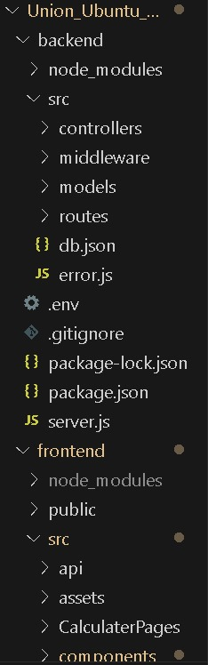
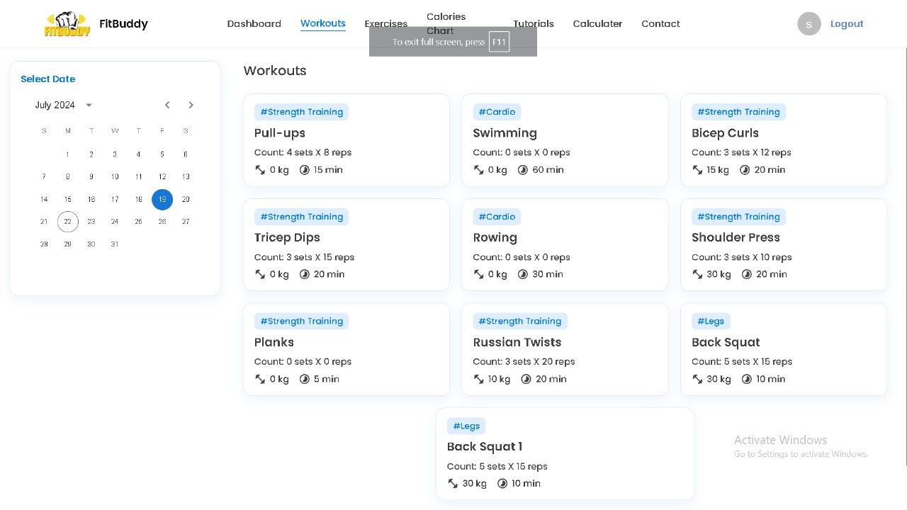
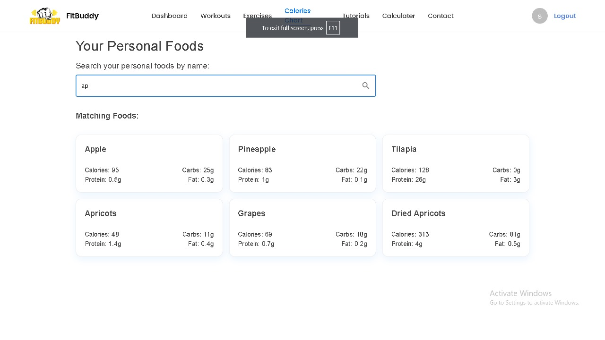
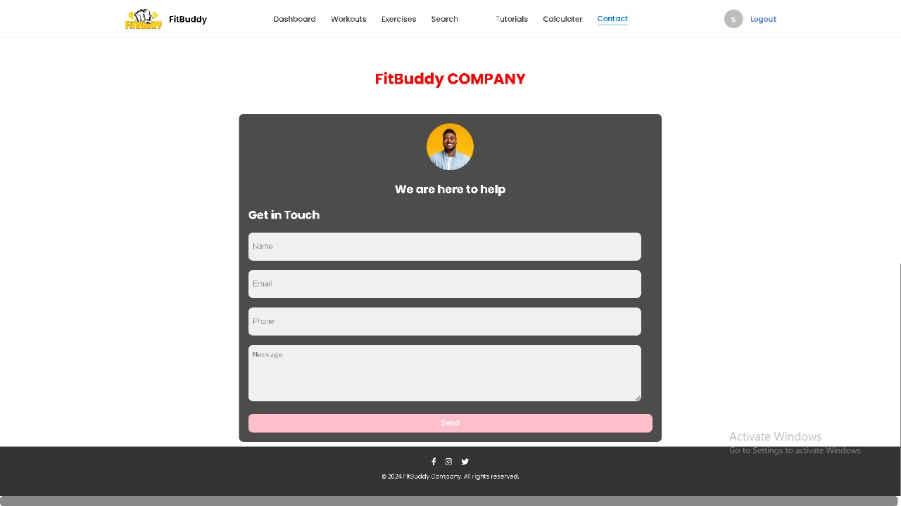
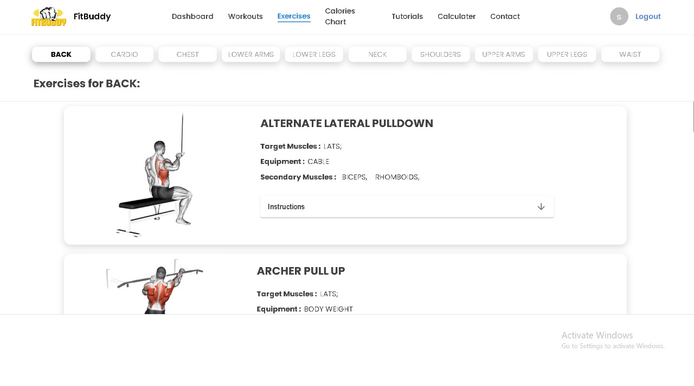

# FitBuddy

Fitbuddy is a comprehensive fitness app designed to support users in tracking and managing their workout routines, meal intake, and overall fitness progress. It offers features like detailed workout logging, nutritional tracking, calendar integration for scheduling fitness activities, and progress monitoring tools. Fitbuddy aims to help users achieve their fitness goals through personalized workout and meal plans, while also fostering a supportive community through social features and professional advice.

### Project Type

Frontend | Backend

### Deployed Link

- FitBuddy: [Live Demo](https://union-ubuntu-046.vercel.app/)

### Directory Structure



### video Walkthrough of the project

-[Presentation Link](https://youtu.be/KAi-4gsl1bU)

### Screenshots

**Landing Page**


**Login and Signup Page**


**Workout Detail Page**



**Search Page**



**Contact Detail Page**



**Exercise Detail Page**



**Admin Dashboard**


### Features

- **Login and Signup**: "Effortlessly access exclusive deals by logging in or sign up for personalized shopping experiences"
- **Responsive and Dynamic**: The website adapts seamlessly to any device, ensuring a smooth and intuitive experience across desktop, tablet, and mobile.
- **Admin Dashboard (CRUD Operations)**: (For authorized users) Admins can manage the platform effectively with a comprehensive dashboard enabling them to Create, Read, Update, and Delete courses, user accounts, and 
   other critical data.
- **Search bar**: Easily find the food you want with our intuitive search bar.
- **Add to Workout**: This feature lets users log and customize their exercise routines, track details like sets and reps, and save workouts for future use.
- **Calculator**: This features let user calculate the calories count, BMI, calorie need, body fat calculator, calorie calculator.

 ### Technology Stack

- **HTML**: Provides the structure and content for the web page.
- **CSS**: Handles the UI and styling, ensuring an appealing visual presentation.
- **Javascript**: JavaScript empowers dynamic and interactive web experiences through its versatile scripting capabilities.
- **Json Server**:JSON Server simplifies backend development by allowing you to quickly create a REST API with JSON data, streamlining your development process and enabling rapid prototyping.
- **MaterialUI Library**:Provides responsive designs that adapt to different screen sizes.
- **React.JS**: A JavaScript library for building user interfaces.

### Design Elements

- **Interactive**: Card have the rounded border with light blue shadow.

- **Flex and Grid**: Many of the elements takes the benefits of display flex and display grid to provide more control over the deferent layout in different sections of website.

- **Fonts & Icons**: Integrates React Fonts for enhanced visual elements. By leveraging these resources, the website achieves a modern and visually appealing design, improving readability and user engagement.

### Installation & Getting started

To run the frontend website, enter the following commands in your terminal:

```bash
#Cloning repository
Clone this repository to your local machine.

# Move into the FrontEnd Directory
cd frontEnd/

# Install all dependencies
npm install

# Run the dev server
npm run dev
```

The project uses a mock server deployed using JSON-server on render. The server can be accessed here: 

If you would like to run a local server instead, use the following commands:

```bash
# Move into the BackEnd directory
cd backEnd/

# Run the server
npm run start
```
### Contributors

- [Shobhit Gupta](https://github.com/shobhit9742)
- [Jayant Jagtap](https://github.com/jayantjagtap001)
- [Ashwin Bhagat](https://github.com/asbhagat2020)
- [Shreya Kushwaha](https://github.com/shreya-kushwaha40)

### Acknowledments

- Inspired by the original FitBuddy website.
- Special thanks to our dedicated team for their invaluable contributions to FitBuddy, and to our mentor/IA Aashish Kumar

